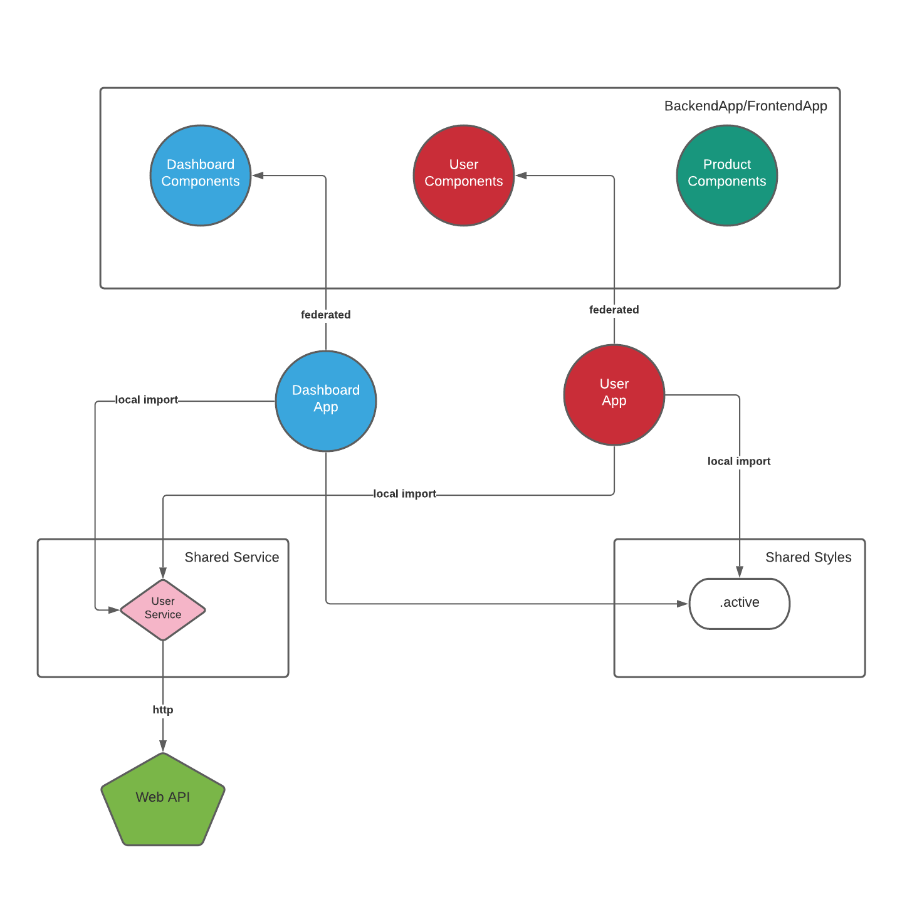

# Module-Federated Ecommerce Backend Application

**Backend App** and **User App** use [Carbon Design System](https://www.carbondesignsystem.com/); 
so at first build, it takes some amount of time to finish; 
be patient! 

Best way to fix it is to only import those components' styles which are needed.

## Technologies

- [Reactjs](https://reactjs.org/)
- [create-mf-app](https://github.com/jherr/create-mf-app)
- [Module Federation](https://webpack.js.org/concepts/module-federation/)
- [Carbon Design System](https://www.carbondesignsystem.com/)

## Live

You can access all of these applications in here.

- [User App](https://standalone-user.vercel.app/)
- [Dashboard App](https://standalone-dashboard.vercel.app/)
- [Backend App](https://backend-app.vercel.app/)

More explanation detail about this example could be found in [here](https://malinka.dev/blog).

Thank to [Jack Herrington](https://www.youtube.com/channel/UC6vRUjYqDuoUsYsku86Lrsw) for his amazing videos about the module federation and the cli.
